# 🚀 CodeMaster — Online Coding & Competitive Programming Platform

<p align="center">
  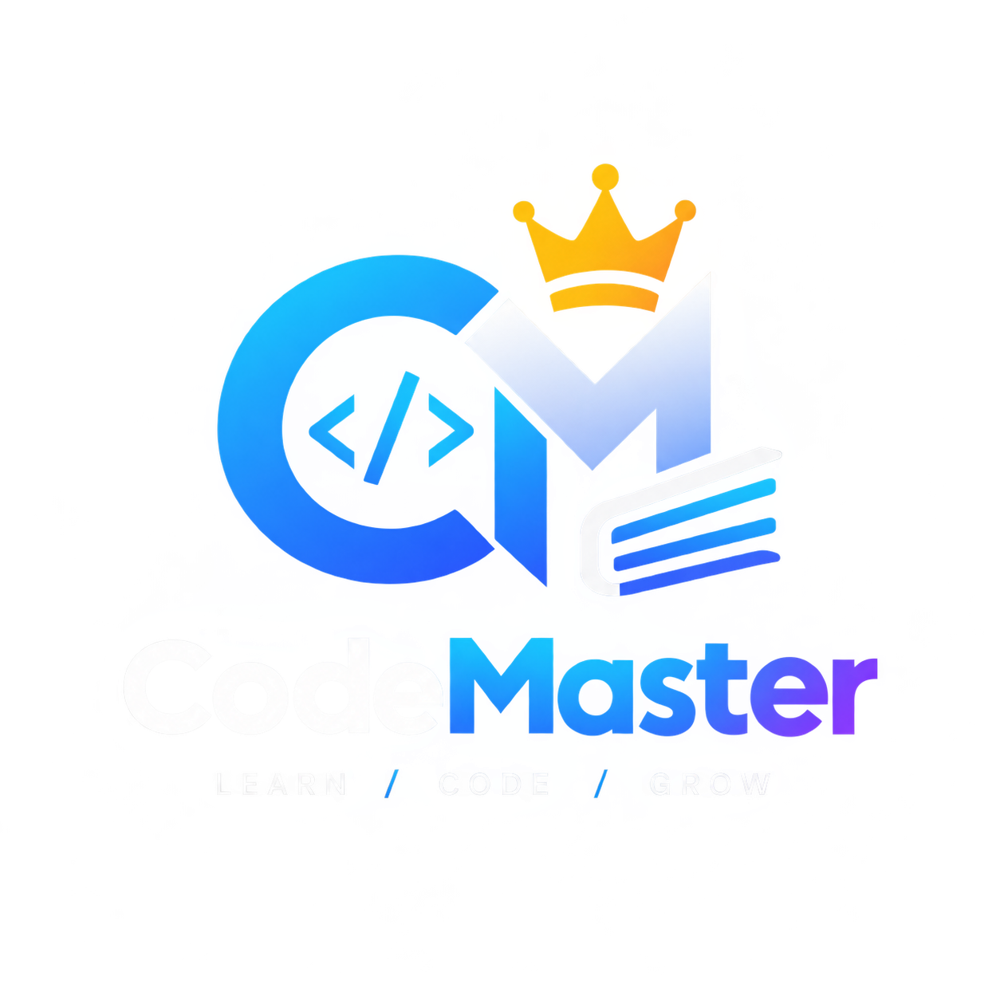
</p>

<h3 align="center">
  Practice. Compete. Improve. Become a Better Developer.
</h3>

<p align="center">
  <b>CodeMaster</b> is a full-stack online coding platform designed to help developers
  practice programming problems, participate in live coding contests, track progress,
  and improve their competitive programming skills.
</p>

<p align="center">

  
  
  
  
  
  

</p>

---

## 🌐 Live Demo

🔗 **Live Application:**
`https://your-live-link.onrender.com`

> Replace the URL above with your deployed CodeMaster application URL.

---

# 📌 About CodeMaster

**CodeMaster** is a web-based competitive programming and coding practice platform.

The platform provides an interactive environment where users can:

* 🧑‍💻 Solve programming problems
* 🏆 Participate in coding contests
* ⚡ Practice problems based on difficulty
* 📊 Track solved problems
* 📈 Build coding ratings
* 🥇 View leaderboard rankings
* 🔓 Progress through contest problems
* ⏱️ Solve problems within contest time limits
* 👤 Manage their profile
* 📜 View their coding achievements

The project focuses on creating a modern coding-platform experience similar to popular competitive programming systems while keeping the interface simple, responsive, and beginner-friendly.

---

# ✨ Key Features

## 🧑‍💻 Online Coding Practice

CodeMaster provides programming problems categorized by difficulty:

| Difficulty | Description                         |
| ---------- | ----------------------------------- |
| 🟢 Easy    | Beginner-friendly problems          |
| 🟡 Medium  | Intermediate algorithmic problems   |
| 🔴 Hard    | Advanced problem-solving challenges |

Users can select a problem, write their solution, run the code, and submit it.

---

## 🏆 Live Coding Contests

The contest system allows users to participate in time-limited programming competitions.

### Contest Features

* ⏱️ Real-time contest timer
* 📋 Multiple coding problems
* 🔐 Sequential problem unlocking
* ✅ Submission tracking
* 📊 Contest progress tracking
* 🏅 Contest results
* 🚫 Contest end-time validation
* 💾 Browser-based progress persistence

### Contest Flow

```text
Join Contest
     ↓
Problem 1 Unlocked
     ↓
Submit Solution
     ↓
Problem 2 Unlocked
     ↓
Submit Solution
     ↓
Problem 3 Unlocked
     ↓
Continue...
     ↓
Contest Completed
```

---

# 🔐 Sequential Problem Unlocking

One of the important features of CodeMaster contests is **progressive problem unlocking**.

Users cannot directly access all problems.

For example:

```text
Problem 1 → 🔓 Unlocked
Problem 2 → 🔒 Locked
Problem 3 → 🔒 Locked
Problem 4 → 🔒 Locked
Problem 5 → 🔒 Locked
```

After successfully submitting Problem 1:

```text
Problem 1 → ✅ Solved
Problem 2 → 🔓 Unlocked
Problem 3 → 🔒 Locked
Problem 4 → 🔒 Locked
Problem 5 → 🔒 Locked
```

This creates a structured contest progression system.

---

# ⏱️ Contest Timer

Each contest has a predefined duration.

The contest page continuously tracks:

```text
Hours : Minutes : Seconds
```

When the contest reaches its end time:

```text
Contest Ended
```

New submissions are prevented after the contest expires.

---

# 📊 Rating System

CodeMaster includes a problem-based rating system.

Ratings are calculated based on successfully solved problems.

### Rating Points

| Difficulty | Points |
| ---------- | -----: |
| 🟢 Easy    |    +10 |
| 🟡 Medium  |    +20 |
| 🔴 Hard    |    +30 |

Example:

```text
Easy Problems Solved   = 5
Medium Problems Solved = 3
Hard Problems Solved   = 2
```

Rating:

```text
5 × 10 = 50
3 × 20 = 60
2 × 30 = 60

Total Rating = 170
```

This ensures that the rating reflects actual coding progress rather than assigning a default rating to every new user.

---

# 🥇 Leaderboard

CodeMaster provides a competitive leaderboard where users can compare their coding progress.

Leaderboard information can include:

* User name
* Profile
* Solved problems
* Rating
* Rank

Example:

```text
┌──────┬──────────────┬─────────┬─────────┐
│ Rank │ User         │ Solved  │ Rating  │
├──────┼──────────────┼─────────┼─────────┤
│  1   │ CodeMaster   │ 45      │ 850     │
│  2   │ Developer01  │ 38      │ 720     │
│  3   │ ProgrammerX  │ 31      │ 610     │
└──────┴──────────────┴─────────┴─────────┘
```

---

# 📈 User Progress

Each user's coding activity can be tracked through their profile and dashboard.

The dashboard provides information such as:

* Total solved problems
* Easy problems
* Medium problems
* Hard problems
* Current rating
* Rank
* Contest participation
* Recent activity

---

# 🧩 Problem Categories

The platform supports different types of programming challenges including:

### Arrays

* Two Sum
* Maximum Subarray
* Array Manipulation

### Strings

* String Processing
* Palindrome Problems
* Character Frequency

### Algorithms

* Searching
* Sorting
* Dynamic Programming
* Greedy Algorithms

### Advanced Problems

* Optimization
* Complex Data Structures
* Algorithmic Challenges

---

# 💻 Code Execution

CodeMaster provides an interactive coding environment.

Users can:

```text
Write Code
   ↓
Run Code
   ↓
Check Output
   ↓
Modify Solution
   ↓
Submit
```

The platform validates the submitted solution against the problem requirements.

---

# 🛠️ Technology Stack

## Frontend

* HTML5
* CSS3
* JavaScript
* Font Awesome
* Responsive UI design

## Backend

* Python
* Flask
* REST-style API routes

## Database

* SQLite
* Relational database structure
* User progress tracking
* Contest tracking
* Certificate records

## Development

* Git
* GitHub
* Visual Studio Code
* Python Virtual Environment

## Deployment

* Render

---

# 🏗️ Project Architecture

```text
                    ┌──────────────────────┐
                    │       User           │
                    └──────────┬───────────┘
                               │
                               ▼
                    ┌──────────────────────┐
                    │     Frontend         │
                    │ HTML / CSS / JS      │
                    └──────────┬───────────┘
                               │
                               ▼
                    ┌──────────────────────┐
                    │       Flask          │
                    │      Backend         │
                    └──────────┬───────────┘
                               │
              ┌────────────────┼────────────────┐
              │                │                │
              ▼                ▼                ▼
        ┌──────────┐     ┌───────────┐    ┌───────────┐
        │ Problems │     │ Contests  │    │  Users    │
        └──────────┘     └───────────┘    └───────────┘
              │                │                │
              └────────────────┼────────────────┘
                               ▼
                    ┌──────────────────────┐
                    │       SQLite         │
                    │      Database        │
                    └──────────────────────┘
```

---

# 📁 Project Structure

```text
CodeMaster/
│
├── app.py
├── config.py
├── database.db
├── requirements.txt
├── .env
├── .gitignore
├── README.md
│
├── templates/
│   ├── dashboard.html
│   ├── problems.html
│   ├── contest.html
│   ├── contest_detail.html
│   ├── leaderboard.html
│   ├── profile.html
│   ├── resume.html
│   └── ...
│
├── static/
│   ├── css/
│   │   ├── dashboard.css
│   │   ├── contest.css
│   │   ├── contest_detail.css
│   │   ├── leaderboard.css
│   │   └── ...
│   │
│   ├── js/
│   │   ├── dashboard.js
│   │   ├── contest.js
│   │   ├── contest_detail.js
│   │   └── ...
│   │
│   └── images/
│
└── ...
```

---

# 🔄 Application Workflow

```text
                    START
                      │
                      ▼
               ┌─────────────┐
               │    Login    │
               └──────┬──────┘
                      │
                      ▼
               ┌─────────────┐
               │  Dashboard  │
               └──────┬──────┘
                      │
          ┌───────────┼───────────┐
          │           │           │
          ▼           ▼           ▼
      Problems     Contests   Leaderboard
          │           │           │
          ▼           ▼           │
       Solve      Participate     │
          │           │           │
          └───────────┼───────────┘
                      ▼
                Update Progress
                      │
                      ▼
                Update Rating
                      │
                      ▼
                 Update Rank
```

---

# 🗄️ Database

CodeMaster uses SQLite for persistent data storage.

Important data includes:

### Users

```text
users
├── id
├── username
├── email
├── password
└── profile information
```

### Problems

```text
problems
├── id
├── title
├── description
├── difficulty
├── input
├── output
└── test cases
```

### User Progress

```text
user_progress
├── user_id
├── problem_id
├── status
└── solved_at
```

### Contests

```text
contests
├── id
├── title
├── description
├── duration
├── start_time
└── end_time
```

### Certificates

```text
certificates
├── id
├── user_id
├── contest_id
└── certificate information
```

---

# 🔌 Important API Routes

Some important application endpoints include:

```text
/api/run-code
```

Used for executing submitted code.

```text
/submit_solution
```

Used for submitting a solution.

```text
/api/contests
```

Used for retrieving contest information.

```text
/contests
```

Used for displaying available contests.

```text
/contest/<contest_id>
```

Used for displaying contest details.

---

# 🔒 Security

The application is designed with basic web security practices including:

* Session-based authentication
* HTTP-only cookies
* Environment-based configuration
* Secret key configuration
* Input validation
* Server-side submission validation
* Restricted contest access
* Database-backed user progress

Sensitive configuration values should be stored in environment variables rather than committed to GitHub.

---

# ⚙️ Installation

## 1. Clone Repository

```bash
git clone https://github.com/your-username/CodeMaster.git
```

```bash
cd CodeMaster
```

---

## 2. Create Virtual Environment

### Windows

```bash
python -m venv venv
```

Activate:

```bash
venv\Scripts\activate
```

### Linux / macOS

```bash
python3 -m venv venv
```

```bash
source venv/bin/activate
```

---

## 3. Install Dependencies

```bash
pip install -r requirements.txt
```

---

## 4. Configure Environment Variables

Create a `.env` file:

```env
SECRET_KEY=your_secret_key
```

Add other required environment variables according to your configuration.

> Never upload `.env` to GitHub.

---

## 5. Run the Application

```bash
python app.py
```

The application will start locally.

Open:

```text
http://127.0.0.1:5000
```

---

# 🧪 Testing

Before deployment, verify:

```bash
python app.py
```

Check:

* Registration
* Login
* Dashboard
* Problem solving
* Code execution
* Solution submission
* Contest listing
* Contest timer
* Problem unlocking
* Leaderboard
* Rating calculation
* Profile
* Logout

---

# 🚀 Deployment

CodeMaster can be deployed using platforms such as:

* Render
* Railway
* PythonAnywhere
* VPS / Cloud Server

For Render, configure the application start command according to the Flask entry point.

Example:

```bash
gunicorn app:app
```

Set required environment variables inside the deployment platform.

---

# 🖼️ Screenshots

## 🏠 Home Page

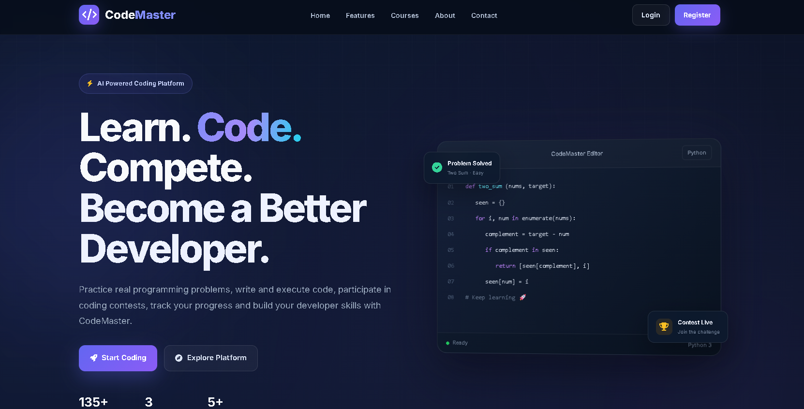

---
## 🏠 Register

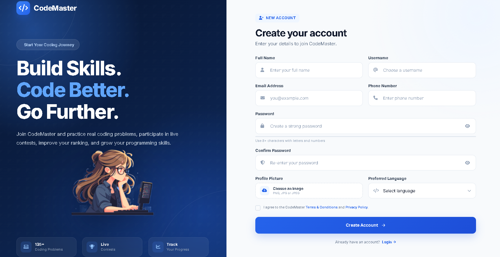

---
## 🏠 login

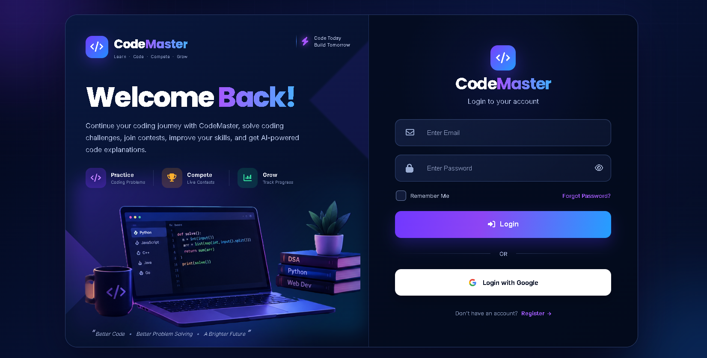

---
## 🏠 Dashboard

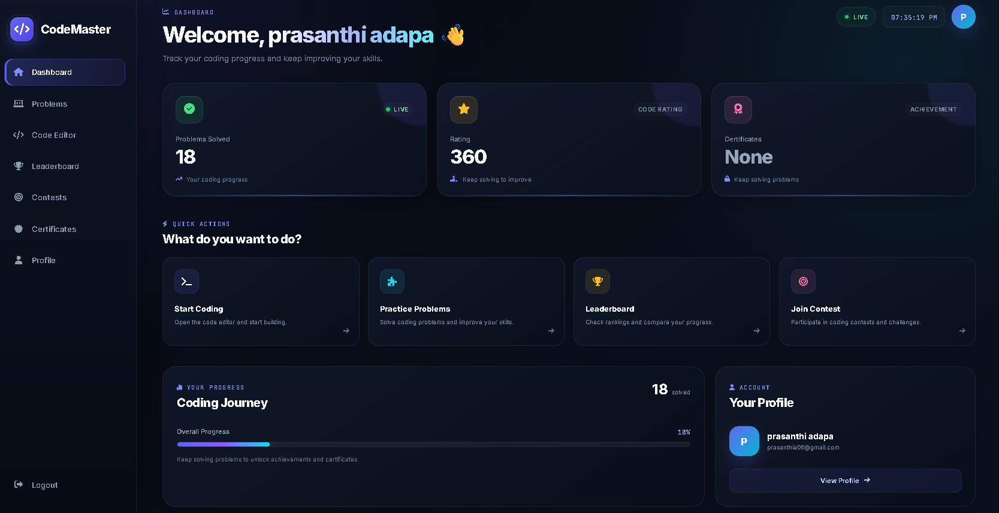

---

## 💻 Coding Problems

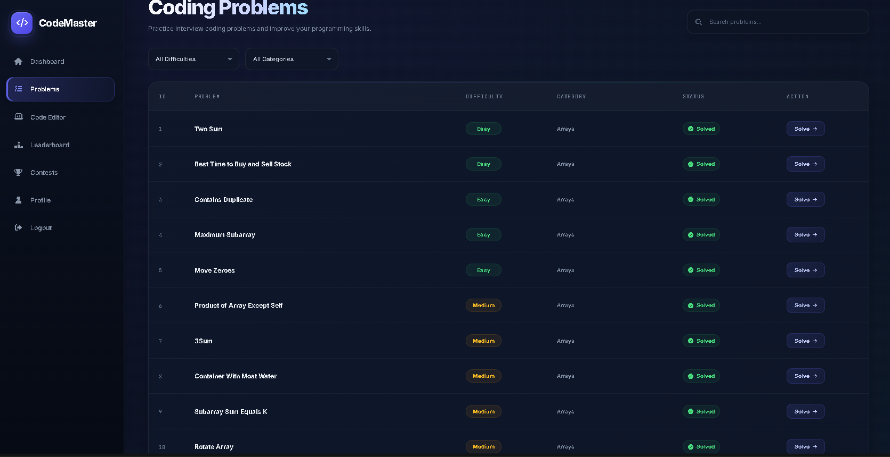

---
## 💻 Coding Editer

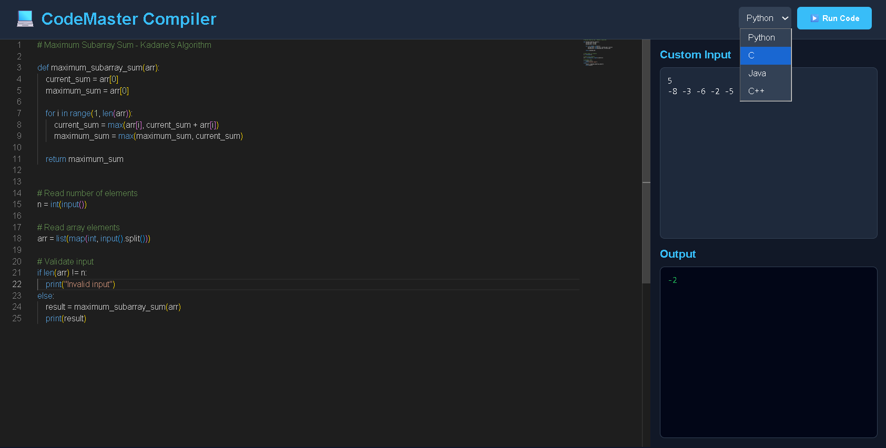

---


## 🏆 Live Contests

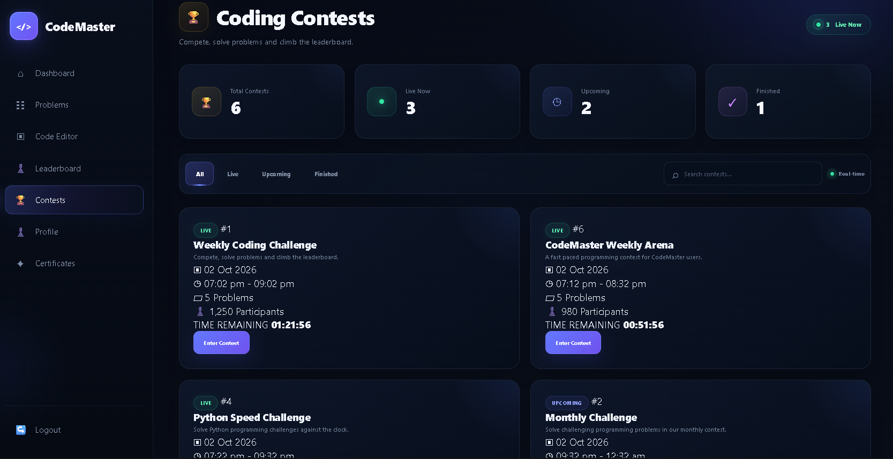

---

## 📝 Contest Details

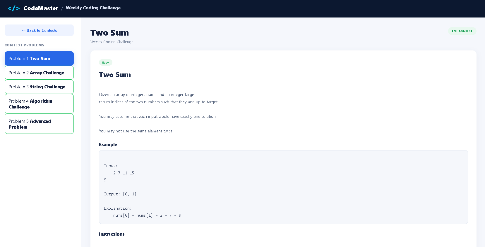

---

## 🥇 Leaderboard

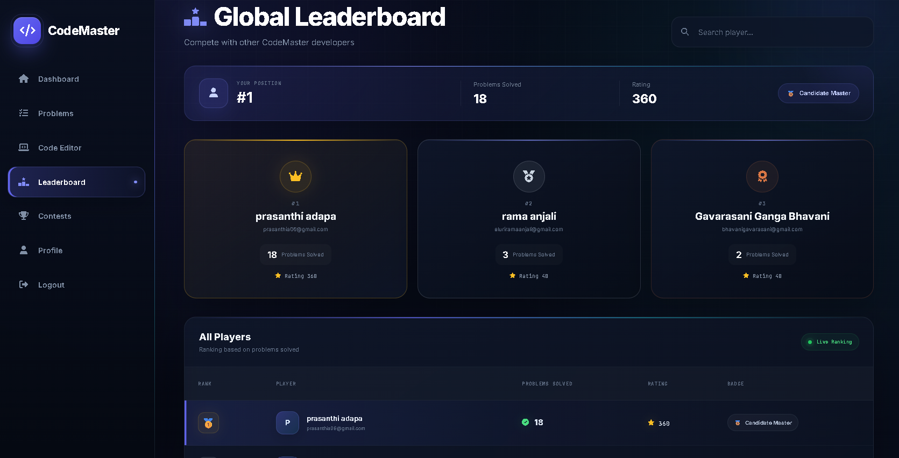

---

## 👤 User Profile

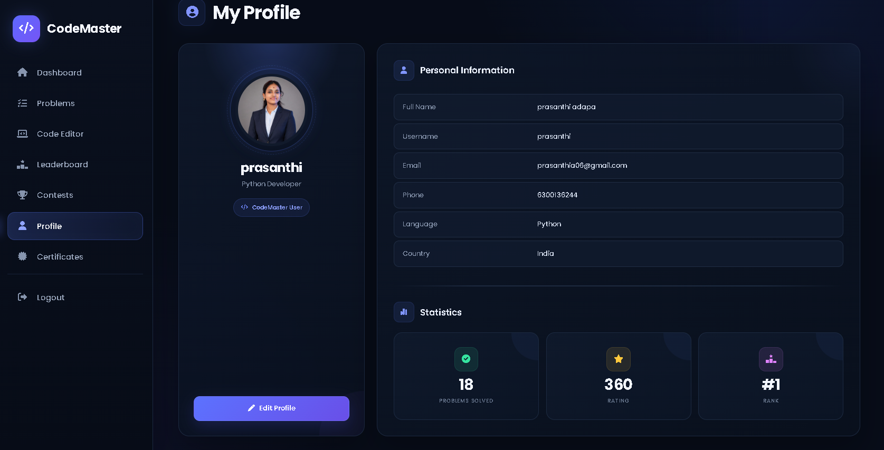

---
## 🏠 certification

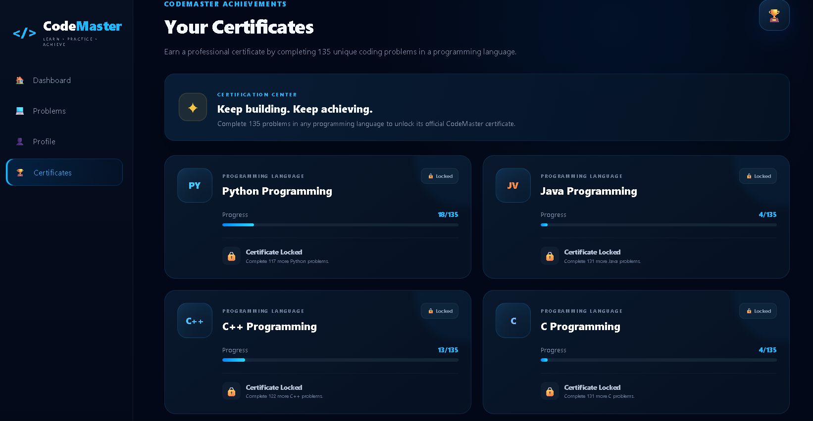

---

# 📊 Current Platform Statistics

CodeMaster includes a structured programming problem collection with multiple difficulty levels.

```text
Total Problems : 135

Easy   : 45
Medium : 45
Hard   : 45
```

The balanced distribution allows users to progress from fundamental programming concepts to advanced algorithmic challenges.

---

# 🎯 Learning Progression

CodeMaster follows a structured learning path:

```text
Beginner
   │
   ▼
Easy Problems
   │
   ▼
Medium Problems
   │
   ▼
Hard Problems
   │
   ▼
Coding Contests
   │
   ▼
Competitive Programming
   │
   ▼
Advanced Problem Solving
```

---

# 🔮 Future Enhancements

Planned improvements include:

* 🤖 AI-powered code explanation
* 🧠 AI-generated hints
* 🐞 Intelligent debugging assistance
* 📊 Advanced performance analytics
* 🌍 Global competitive rankings
* 🏆 More contest formats
* 👥 Team-based contests
* 💬 Coding discussion forum
* 🔔 Real-time notifications
* 🌙 Advanced theme customization
* 📱 Improved mobile experience
* 🧪 Larger automated test-case system
* ⚡ Multi-language code execution
* 📜 Automated achievement certificates

---

# 👨‍💻 Developer

**Prasanthi**

Full-Stack Developer & Project Developer

Interested in:

```text
Python
Flask
Web Development
Competitive Programming
Artificial Intelligence
Software Engineering
```

---

# 🤝 Contributing

Contributions are welcome.

### Steps

```bash
git fork
```

Create a feature branch:

```bash
git checkout -b feature/new-feature
```

Make your changes and commit:

```bash
git add .
git commit -m "Add new feature"
```

Push:

```bash
git push origin feature/new-feature
```

Then open a Pull Request.

---

# 📄 License

This project is developed for educational and software development purposes.

You may modify and extend the project according to your requirements.

---

# ⭐ Support

If you find CodeMaster useful, consider giving the repository a ⭐ on GitHub.

---

<p align="center">
  <b>CodeMaster</b>
  <br>
  Practice • Compete • Learn • Improve
</p>
